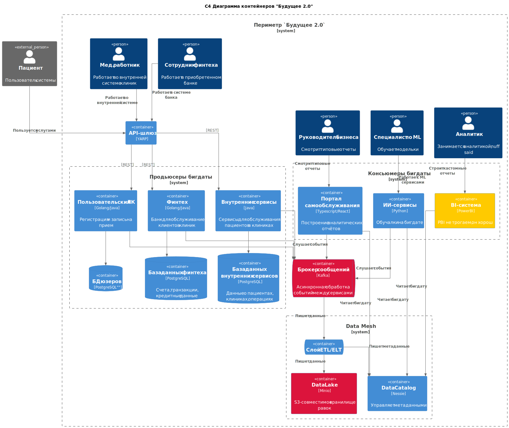

# Задание 1

### Проблемные места текущего лэндскейпа:

| Проблема                         | Описание                                                                                                                                                          |
|----------------------------------|-------------------------------------------------------------------------------------------------------------------------------------------------------------------|
| **Монолитный DWH**               | Один инстанс SQL-Server'a не вывозит терабайты данных. К тому же, к нему идет прямой доступ через Power Builder. Нет разделения разнородных данных по хранилищам. |
| **Медленное построение отчетов** | Вытекает из предыдущего пункта - еле работающий сервер с кучей логики не может оперативно выдавать данные.                                                        |
| **Устаревший стэк**              | 2008 сервер с Power Builder'ом уже давно не поддерживаются, к тому же сейчас еще и лицензию нельзя приобрести.                                                    |
| **Отсутствие тех. радара**       | Нет централизованного управления стэком.                                                                                                                          |

### Приоритизация проблем по MoSCoW:

| Категория   | Проблемы                                                                                                                                                                                              |
|-------------|-------------------------------------------------------------------------------------------------------------------------------------------------------------------------------------------------------|
| Must Have   | * Устаревший стэк - для перехода к современному тех. лэндскейпу придется перейти на современные же технологии;  * Монолитный DWH - проблемы с производительностью и RBAC, решаем в первую очередь |
| Should Have | * Медленное построение отчетов - Это проблема, но с ней можно повременить                                                                                                                             |
| Could Have  | * Отсутствие тех. радара - пока не запустимся управление инструментарием не будет слишком критичным аспектом                                                                                          |
| Won't Have  |                                                                                                                                                                                                       |

### С4 Диаграмма целевой архитектуры:

TLDR:

* Переписываем все легаси с PowerBuilder'a на микросервисы;
* Настраиваем слив данных в ETL;
* Делаем каталогизацию данных в Nessie;
* Создаем отдельные витрины для аналитики;
* Опционально ML и BI могут ходить за данными напрямую;
* На период миграции DWH на SQL Server'e будет торчать сбоку для поддержки старых отчетов.

[container-to-be.puml](./container-to-be.puml)
