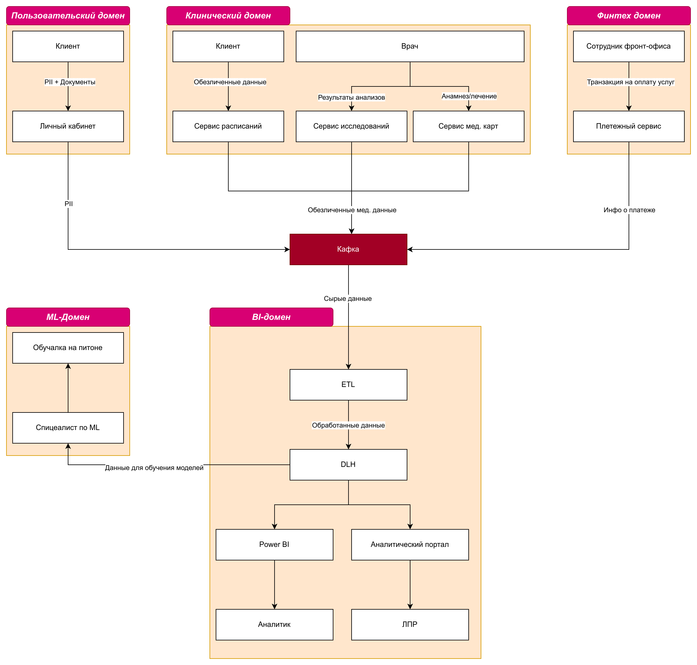

# Задание 2

### Разделение на домены:

1. **Клинический домен**. Отвечает за ведение процесса приема пациента: запись на прием, ведение истории болезни, лабороторные исследования, назначение лечения, оперирование листами нетрудоспособности.
2. **Финансовый домен**. Отвечает за ведение финансовых операций: оплата услуг, выставление счетов, работа с полисами ОМС.
3. **Пользовательский домен**. Отвечает за управление персональными данными как сотрудников, так и пациентов.
4. **ML-домен**. Отвечает за машинное обучение.
5. **BI-домен**. Отвечает за бизнес-аналитику, отчетность и стратегическое планирование. 

### Обоснование разделения:

Каждый домен отвечает за независимую порцию данных, что повышает автономность команд. Это, в свою очередь, ведет к ускорению онбординга/разработки
и снижению TTM. Результатом этого становится снижение стоимости разработки и повышение удовлетворенности клиентов.

Также отделив персональные данные от их предыдущих продуктов (медицина/финтех) мы снижаем вероятность утечки оных в случае компрометации
одной из систем, что повышает комплаенс по 152-ФЗ.
 
Как данные перемещаются между доменами:

[dfd.drawio](./dfd.drawio)

